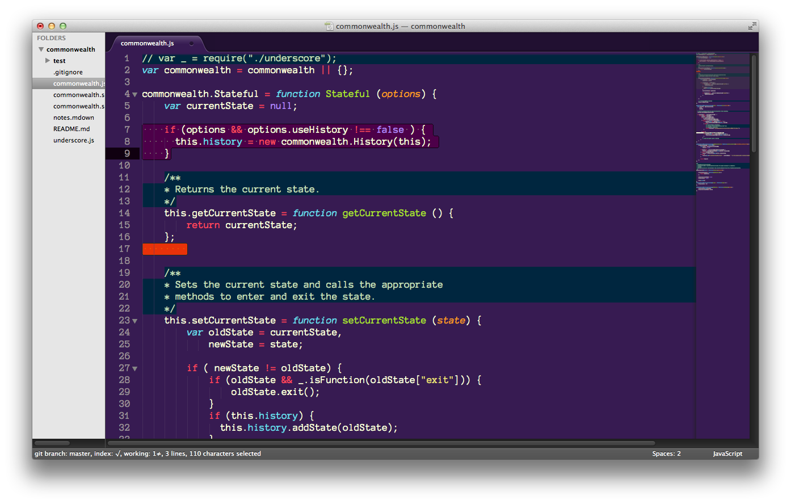

#NOTICE:
**If you're having trouble with the Eggplant Parm package in Package Control, try removing and reinstalling it!**

# Eggplant Parm Color Scheme

A delicious, aubergine color theme for Sublime Text by Mims H. Wright.

A port of this theme for Atom can be found here: [eggplant-parm-syntax](https://github.com/mimshwright/eggplant-parm-syntax)

By the way, I use the free font [Anonymous Pro](http://www.marksimonson.com/fonts/view/anonymous-pro) by Mark Simonson. I like 19pt. So big right? Deal with it!

## Install

### Package Control

- Package Control - Install Package
	- Color Scheme - Eggplant Parm

### ColorSublime

[ColorSublime](http://colorsublime.com/?q=eggplant+parm)

## Compatibility

The theme has been successfully tested with:

* ChocolatApp 1.6-.9
* Sublime Text 2
* Sublime Text 3
